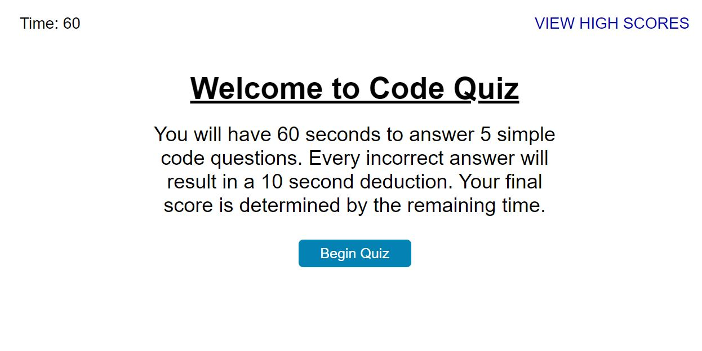

# Code Quiz

## Description
This application serves as a short Code Quiz designed for the beginner. It has simple questions that, when answered correctly, will reward the user with points to go towards their final score. 

## Table Of Contents
* [Usage](#usage)
* [Contributions](#contributions)
* [Questions](#questions)

## Usage
The user can find the quiz [here](https://emilyrh1058.github.io/Ch-4---Code-Quiz/) where they can go through the questions after clicking the "Begin Quiz" button.

## Contributions
This application was created by Emily Salinas.

## Questions
Should you have any further questions regarding this application please feel free to reach out to me via [GitHub](https://github.com/Emilyrh1058) or [email](mailto:emilyrh1058@gmail.com).

## Code Quiz Screenshot

